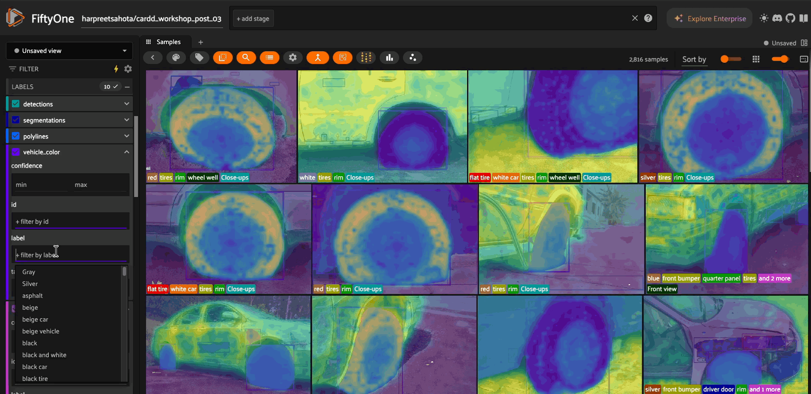

# FiftyOne + Weights & Biases Plugin

**Track your computer vision experiments with complete data-model lineage.**


This plugin connects [FiftyOne](https://docs.voxel51.com/) datasets with [Weights & Biases](https://wandb.ai/) to enable reproducible, data-centric ML workflows.

## What You Can Do

- ✅ **Track training data** - Log curated FiftyOne views as WandB dataset artifacts
- ✅ **Track model predictions** - Log inference results with detection-level granularity  
- ✅ **Track VLM outputs** - Special support for vision-language model workflows
- ✅ **Reproduce experiments** - Recreate exact training views from WandB artifacts
- ✅ **Compare strategies** - A/B test data curation, model versions, and prompting approaches


---

## Installation

```bash
# Install dependencies
pip install -U fiftyone wandb

# Download and install plugin
fiftyone plugins download https://github.com/harpreetsahota204/fiftyone_wandb_plugin

# Verify installation
fiftyone plugins list
# Should show: @harpreetsahota/wandb
```

---

## Configuration

Set your WandB credentials as environment variables:

```bash
# Required
export FIFTYONE_WANDB_API_KEY="your-api-key-here"

# Optional (can also specify per-operation)
export FIFTYONE_WANDB_ENTITY="your-username-or-team"
export FIFTYONE_WANDB_PROJECT="your-default-project"
```

Get your API key at [wandb.ai/authorize](https://wandb.ai/authorize).

**Alternative:** Use `wandb login` to cache credentials locally.

---

## Quick Start

### 1. Track Training Data




```python
import fiftyone as fo
import fiftyone.operators as foo
import wandb

# Load and curate your data
dataset = fo.load_dataset("my_dataset")
train_view = dataset.match_tags("train")

# Start WandB run
wandb.init(project="my-project", name="experiment-1")

# Log the training view with all labels
operator = foo.get_operator("@harpreetsahota/wandb/log_fiftyone_view_to_wandb")
operator(
    train_view,
    project="my-project",
    run_id=wandb.run.id,
    include_labels=True  # Logs all label types to WandB Table
)

# Train your model...
wandb.finish()
```

**What gets logged to WandB:**
- Sample IDs (for exact reproducibility)
- All label fields (Detection, Classification, Segmentation, etc.)
- Dataset statistics and metadata
- Thumbnail images in interactive WandB Tables

### 2. Track Model Predictions


```python
import fiftyone.zoo as foz

# Load model and run inference
model = foz.load_zoo_model("yolov8n-coco-torch")
dataset.apply_model(model, label_field="predictions")

# Log predictions to WandB
operator = foo.get_operator("@harpreetsahota/wandb/log_model_predictions")
result = operator(
    dataset,
    model_name="yolov8n",
    model_version="v1.0",
    predictions_field="predictions",
    project="my-project"
)

print(f"Logged {result['total_predictions']} predictions")
print(f"View in WandB: {result['wandb_url']}")
```

**What gets logged:**
- Per-sample prediction counts: `"person(5), car(3), dog(2)"`
- Average confidence scores
- Class distribution across all predictions
- Low-confidence label IDs for active learning

---

## Complete Examples

### Example 1: Data Ablation Study

Compare model performance on different data curation strategies:

```python
import fiftyone as fo
import fiftyone.operators as foo
from fiftyone import ViewField as F
import wandb

dataset = fo.load_dataset("my_dataset")
operator = foo.get_operator("@harpreetsahota/wandb/log_fiftyone_view_to_wandb")

# Experiment 1: Full dataset baseline
wandb.init(project="ablation", name="baseline-full")
operator(dataset, project="ablation", run_id=wandb.run.id, include_labels=True)
wandb.finish()

# Experiment 2: High quality samples only
wandb.init(project="ablation", name="high-quality-only")
high_quality = dataset.match(F("quality_score") > 0.8)
operator(high_quality, project="ablation", run_id=wandb.run.id, include_labels=True)
wandb.finish()

# Experiment 3: Balanced class distribution
wandb.init(project="ablation", name="balanced-classes")
balanced = dataset.take(100, seed=42)  # Smart sampling per class
operator(balanced, project="ablation", run_id=wandb.run.id, include_labels=True)
wandb.finish()

# Compare in WandB to see which curation strategy yields best results!
```

### Example 2: Model Version Comparison

Track predictions from different model versions:

```python
import fiftyone as fo
import fiftyone.operators as foo
import fiftyone.zoo as foz

dataset = fo.load_dataset("my_dataset")
operator = foo.get_operator("@harpreetsahota/wandb/log_model_predictions")

# Model V1: YOLOv8 Nano
model_v1 = foz.load_zoo_model("yolov8n-coco-torch")
dataset.apply_model(model_v1, label_field="predictions_v1")

operator(
    dataset,
    model_name="yolov8n",
    model_version="v1.0",
    predictions_field="predictions_v1",
    project="model-comparison"
)

# Model V2: YOLOv8 Small (larger, more accurate)
model_v2 = foz.load_zoo_model("yolov8s-coco-torch")
dataset.apply_model(model_v2, label_field="predictions_v2")

operator(
    dataset,
    model_name="yolov8s",
    model_version="v2.0",
    predictions_field="predictions_v2",
    project="model-comparison"
)

# Check WandB artifacts to compare:
# - Prediction counts per sample
# - Class distributions
# - Confidence levels
```

### Example 3: Active Learning Workflow

Use WandB artifacts to drive your active learning loop:

```python
import fiftyone as fo
import fiftyone.operators as foo
import fiftyone.zoo as foz
import wandb

dataset = fo.load_dataset("my_dataset")

# Step 1: Apply model and log predictions
model = foz.load_zoo_model("yolov8n-coco-torch")
dataset.apply_model(model, label_field="predictions")

operator = foo.get_operator("@harpreetsahota/wandb/log_model_predictions")
result = operator(
    dataset,
    model_name="yolov8n",
    predictions_field="predictions",
    project="active-learning"
)

# Step 2: Download artifact to get low-confidence detections
api = wandb.Api()
artifact = api.artifact(f"entity/active-learning/{result['artifact_name']}:latest")
low_conf_label_ids = artifact.metadata["low_confidence_label_ids"]

print(f"Found {len(low_conf_label_ids)} uncertain predictions")

# Step 3: Select those specific detections in FiftyOne
uncertain_view = dataset.select_labels(ids=low_conf_label_ids)
session = fo.launch_app(uncertain_view)

# Step 4: Review in FiftyOne, fix labels, retrain, repeat!
```

### Example 4: Vision-Language Model Tracking

Track VLM inference with per-sample prompts:

```python
import fiftyone as fo
import fiftyone.operators as foo

dataset = fo.load_dataset("traffic-dataset")

# Step 1: Add per-sample prompts to your dataset
for sample in dataset:
    # Example: different prompt for each sample based on context
    sample["user_prompt"] = f"Analyze frame {sample.id}: Describe all vehicles and traffic conditions."
    sample.save()

# Step 2: Run your VLM inference (example)
# After inference, VLM outputs are stored as strings in a field
# For example: sample["vlm_output"] = "2 cars traveling at 65mph, 1 truck..."

# Step 3: Log to WandB with both global config and per-sample prompts
operator = foo.get_operator("@harpreetsahota/wandb/log_model_predictions")
operator(
    dataset,
    model_name="gpt-4-vision",  # or "claude-3", "llava", etc.
    predictions_field="vlm_output",
    project="traffic-analysis",
    
    # Global config (same for all samples)
    model_config={
        "system_prompt": "You are an expert traffic safety analyst with 20 years of experience.",
        "temperature": 0.7,
        "max_tokens": 150,
        "model_version": "gpt-4-vision-preview"
    },
    
    # Per-sample prompts (field containing unique prompts for each sample)
    prompt_field="user_prompt"
)

# WandB Table will show:
# | sample_id | prompt                        | predictions                                    |
# |-----------|-------------------------------|------------------------------------------------|
# | 001       | "Analyze frame 001: Describe..." | "2 cars traveling at 65mph, 1 truck in right lane..." |
# | 002       | "Analyze frame 002: Describe..." | "Red traffic light at intersection, 2 pedestrians..." |
```

---

## Using the FiftyOne App

All operators have interactive UIs in the FiftyOne App:

### Log Training View

1. Open your dataset: `fo.launch_app(dataset)`
2. **Create your view** (apply filters, select samples)
3. Click backtick (`) to open the operators menu → **"W&B: Save View as Artifact"**
4. Choose target:
   - 📦 **Dataset** - All samples
   - 🔍 **Current view** - Filtered samples  
   - ⭐ **Selected samples** - Hand-picked samples
5. Toggle **"Include Labels"** ON
6. Enter your WandB Run ID (optional - auto-generated if not provided)
7. Execute!

### Log Model Predictions

1. First, run inference in your script:
   ```python
   model = foz.load_zoo_model("yolov8n-coco-torch")
   dataset.apply_model(model, label_field="predictions")
   ```
2. Open FiftyOne App: `fo.launch_app(dataset)`
3. Optionally select specific samples
4. Click operators menu → **"W&B: Log Model Predictions"**
5. Fill in model name and predictions field
6. Execute!

---

## Reproducing Experiments

### Recreate Training Data


Every training view is stored with sample IDs in WandB metadata. You can recreate views either manually or using the plugin operator:

**Option 1: Using the Plugin Operator (Recommended)**

```python
import fiftyone as fo
import fiftyone.operators as foo

# Open your dataset
dataset = fo.load_dataset("my_dataset")
session = fo.launch_app(dataset)

# Use the operator to load the view from WandB
# This can be done via the UI (backtick menu → "W&B: Load View from Artifact")
# Or programmatically:
operator = foo.get_operator("@harpreetsahota/wandb/load_view_from_wandb")

# Note: load_view_from_wandb currently works best through the UI
# as it needs interactive project/artifact selection
```

**Option 2: Manual Reconstruction**

```python
import fiftyone as fo
import wandb

# Download the artifact
api = wandb.Api()
artifact = api.artifact("entity/project/training_view:v2")

# Get exact sample IDs used for training
sample_ids = artifact.metadata["sample_ids"]

# Recreate the view instantly
dataset = fo.load_dataset("my_dataset")
train_view = dataset.select(sample_ids)

print(f"Recreated training view with {len(train_view)} samples")

# Now you can:
# - Retrain on the exact same data
# - Analyze what made this experiment work
# - Compare against other versions
```

### Link Predictions Back to Runs

```python
import fiftyone.operators as foo

# After training in WandB
operator = foo.get_operator("@harpreetsahota/wandb/log_wandb_run")
operator(
    dataset,
    project_name="my-project",
    run_name="experiment-42",
    predictions_field="predictions"  # Links this field to the run
)

# Now in FiftyOne App:
# - Click the WandB button
# - Automatically opens the dashboard for this run
```

---

## Supported Label Types

The plugin automatically handles **all 15 FiftyOne label types**:

| Type | Format in WandB Table |
|------|----------------------|
| **Classification** | `"cat (0.95)"` |
| **Detection** | `"dog (0.88)"` |
| **Detections** | `"18 detections: person(5), car(3), dog(2)"` |
| **Polyline** | `"road (25 points)"` |
| **Polylines** | `"5 polylines: road(3), sidewalk(2)"` |
| **Keypoint** | `"nose"` |
| **Keypoints** | `"17 keypoints: nose(1), left_eye(1), ..."` |
| **Segmentation** | `"segmentation mask"` |
| **Heatmap** | `"heatmap [0.00, 1.00]"` |
| **TemporalDetection** | `"action (0.92) @ [10, 45]"` |
| **TemporalDetections** | `"5 temporal detections: action(3), ..."` |
| **GeoLocation** | `"point [lon, lat]"` or `"polygon (10 points)"` |
| **GeoLocations** | `"5 geolocations"` |
| **Regression** | `"3.14 (0.89)"` |

All labels are automatically detected and formatted for clear visualization in WandB Tables.

---
After running, check your WandB dashboard:
```
https://wandb.ai/YOUR-ENTITY/test-project
```

You should see:
- Multiple dataset artifacts with metadata
- Interactive WandB Tables showing labels
- Sample IDs in artifact metadata (for reproducibility)

---

## Troubleshooting

### "FIFTYONE_WANDB_API_KEY not set"

```bash
export FIFTYONE_WANDB_API_KEY="your-key"
# Or: wandb login
```

### "wandb is not installed"

```bash
pip install wandb
```

### "Could not find WandB run"

- Verify project name is correct
- Ensure run ID exists in WandB
- Check you have access to the project
- Run must be finished before calling `log_fiftyone_view_to_wandb`

### Large datasets are slow

For large datasets with `include_labels=True`, the operator automatically delegates to a background process. You'll see a progress bar in the FiftyOne App.

To keep artifacts small:
- Set `include_labels=False` (lightweight mode)
- Use `include_images=False` when logging predictions
- Filter your view before logging

---

## Plugin Operators


The plugin provides these operators (accessible via Python or FiftyOne App):

| Operator | Purpose |
|----------|---------|
| `log_fiftyone_view_to_wandb` | Log training data to WandB |
| `log_model_predictions` | Log inference results to WandB |
| `load_view_from_wandb` | Recreate FiftyOne view from WandB artifact |
| `log_wandb_run` | Link WandB run to FiftyOne dataset |
| `show_wandb_run` | Display WandB run in FiftyOne panel |
| `show_wandb_report` | Display WandB report in FiftyOne panel |
| `open_wandb_panel` | Open WandB panel in FiftyOne App |
| `get_wandb_run_info` | Retrieve run metadata |

---

## Best Practices

### 1. Always Log Training Views

```python
# ✅ Good: Track what data was used
wandb.init(project="my-project")
operator(train_view, project="my-project", run_id=wandb.run.id, include_labels=True)
# Train...

# ❌ Bad: No record of training data
wandb.init(project="my-project")
# Train... (what data was used? 🤷)
```

### 2. Use Descriptive Artifact Names

```python
# ✅ Good
operator(view, artifact_name="coco_train_high_quality_v2", ...)

# ❌ Bad (auto-generated)
operator(view, ...)  # Creates "training_view_abc123"
```

### 3. Version Your Data

```python
# Track data improvements over time
operator(view_v1, artifact_name="training_data_v1", ...)
# ... improve data curation ...
operator(view_v2, artifact_name="training_data_v2", ...)
# ... compare results in WandB ...
```

### 4. Log Early in Training Scripts

```python
# ✅ Good: Log right after wandb.init()
wandb.init(project="my-project")
operator(view, project="my-project", run_id=wandb.run.id, include_labels=True)
# Train...
wandb.finish()

# ❌ Bad: Logging at the end
# Train...
operator(...)  # Too late! Run may have failed
wandb.finish()
```

---

## Links

- [FiftyOne Documentation](https://docs.voxel51.com/)
- [Weights & Biases Documentation](https://docs.wandb.ai/)
- [Report Issues](https://github.com/harpreetsahota204/fiftyone_wandb_plugin/issues)
- [FiftyOne Slack Community](https://slack.voxel51.com/)

---

## License

This plugin is licensed under the Apache 2.0 license