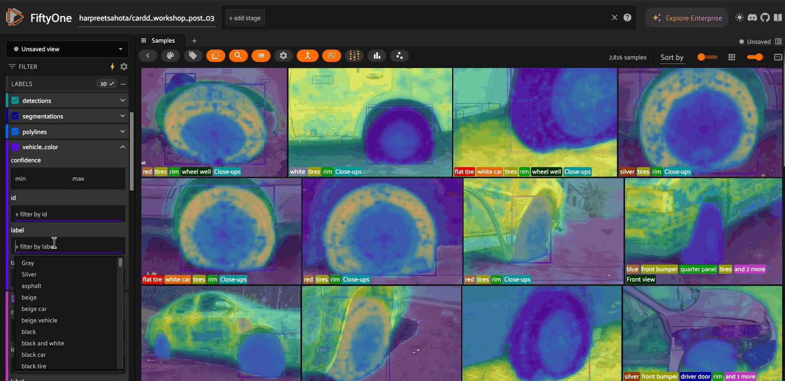

# FiftyOne + Weights & Biases Plugin

**Track your computer vision experiments with complete data-model lineage.**


This plugin connects [FiftyOne](https://docs.voxel51.com/) datasets with [Weights & Biases](https://wandb.ai/) to enable reproducible, data-centric ML workflows.

## What You Can Do

- **Track training data** - Log curated FiftyOne views as W&B dataset artifacts
- **Track model predictions** - Log inference results with detection-level granularity  
- **Track VLM outputs** - Special support for vision-language model workflows
- **Reproduce experiments** - Recreate exact training views from W&B artifacts
- **Compare strategies** - A/B test data curation, model versions, and prompting approaches


---

## Installation

```bash
# Install dependencies
pip install -U fiftyone wandb

# Download and install plugin
fiftyone plugins download https://github.com/harpreetsahota204/fiftyone_wandb_plugin

# Verify installation
fiftyone plugins list
# Should show: @harpreetsahota/wandb
```

---

## Configuration

Set your W&B credentials as environment variables:

```bash
# Required
export FIFTYONE_WANDB_API_KEY="your-api-key-here"
export FIFTYONE_WANDB_ENTITY="your-entity-name"

# Optional (can also specify per-operation)
export FIFTYONE_WANDB_PROJECT="your-project"

# Optional: Custom W&B URL for hosted/managed deployments (defaults to https://wandb.ai)
export FIFTYONE_WANDB_URL="https://your-custom-url.com"
```

Get your API key at [wandb.ai/authorize](https://wandb.ai/authorize).

**Alternative:** Use `wandb login` to cache credentials locally.

---

## Complete Example

For a complete end-to-end workflow demonstrating data curation strategies as experiment variables, see the **[using_fo_wandb_plugin.ipynb](using_fo_wandb_plugin.ipynb)** notebook.

[](https://colab.research.google.com/github/harpreetsahota204/fiftyone_wandb_plugin/blob/main/using_fo_wandb_plugin.ipynb)

The notebook walks through:
1. Loading a dataset and computing data quality metrics
2. Creating multiple curation strategies (baseline, deduplicated, high-uniqueness, high-representativeness)
3. Logging each strategy to W&B before training
4. Training models on each strategy with full lineage tracking
5. Comparing results and recreating the winning strategy's training data

---

## Quick Start

### Log a Training View to W&B



```python
import fiftyone as fo
import fiftyone.operators as foo
import wandb

# Load and curate your data
dataset = fo.load_dataset("my_dataset")
train_view = dataset.match_tags("train")

# Start W&B run
wandb.init(project="my-project", name="experiment-1")

# Log the training view with all labels
log_view = foo.get_operator("@harpreetsahota/wandb/log_fiftyone_view_to_wandb")
log_view(
    train_view,
    project="my-project",
    run_id=wandb.run.id,
    include_labels=True  # Logs all label types to W&B Table
)

# Train your model...
wandb.finish()
```

**What gets logged to W&B:**
- Sample IDs (for exact reproducibility)
- All label fields (Detection, Classification, Segmentation, etc.)
- Dataset statistics and metadata
- Thumbnail images in interactive W&B Tables

### Log Model Predictions


```python
import fiftyone.zoo as foz

# Load model and run inference
model = foz.load_zoo_model("yolov8n-coco-torch")
dataset.apply_model(model, label_field="predictions")

# Log predictions to W&B
log_preds = foo.get_operator("@harpreetsahota/wandb/log_model_predictions")
result = log_preds(
    dataset,
    model_name="yolov8n",
    model_version="v1.0",
    predictions_field="predictions",
    project="my-project"
)

print(f"Logged {result['total_predictions']} predictions")
print(f"View in W&B: {result['wandb_url']}")
```

**What gets logged:**
- Per-sample prediction counts (e.g., `"person(5), car(3), dog(2)"`)
- Average confidence scores
- Class distribution across all predictions
- Low-confidence label IDs for active learning

### Recreate a Training View from W&B


Every training view is stored with sample IDs in W&B metadata. Recreate views months later:

```python
import fiftyone as fo
import wandb

# Download the artifact
api = wandb.Api()
artifact = api.artifact("entity/project/training_view:v2")

# Get exact sample IDs used for training
sample_ids = artifact.metadata["sample_ids"]

# Recreate the view instantly
dataset = fo.load_dataset("my_dataset")
train_view = dataset.select(sample_ids)

print(f"Recreated training view with {len(train_view)} samples")
```

Or use the plugin operator directly:

```python
load_view = foo.get_operator("@harpreetsahota/wandb/load_view_from_wandb")
recreated_view = load_view(
    dataset,
    project="my-project",
    artifact="training_view:latest"
)
```

---

## Using the FiftyOne App

All operators have interactive UIs in the FiftyOne App:

1. Open your dataset: `fo.launch_app(dataset)`
2. Press backtick (`) to open the operators menu
3. Select a W&B operator:
   - **"W&B: Save View as Artifact"** - Log training data
   - **"W&B: Log Model Predictions"** - Log inference results
   - **"W&B: Load View from Artifact"** - Recreate views
   - **"Show W&B Run"** - View training curves alongside your data
   - **"Show W&B Report"** - Embed reports in the panel

---

## Plugin Operators


### Core Operators

| Operator | Purpose |
|----------|---------|
| `log_fiftyone_view_to_wandb` | Log training data views as W&B artifacts |
| `log_model_predictions` | Log inference results to W&B |
| `load_view_from_wandb` | Recreate FiftyOne view from W&B artifact |
| `log_wandb_run` | Link W&B run to FiftyOne dataset |
| `show_wandb_run` | Display W&B run in FiftyOne panel |
| `show_wandb_report` | Display W&B report in FiftyOne panel |
| `open_wandb_panel` | Open W&B panel in FiftyOne App |
| `get_wandb_run_info` | Retrieve run metadata |

### Training Workflow Examples

The plugin also includes example operators for training workflows:

| Operator | Purpose |
|----------|---------|
| `train_yolo_model` | Train YOLO models with W&B tracking |
| `apply_yolo_model_from_registry` | Apply YOLO models from W&B model registry |

These demonstrate how to build end-to-end training pipelines with full data-model lineage. See the [notebook](using_fo_wandb_plugin.ipynb) for usage examples.

> **Future plans:** We're working on adding support for Hugging Face SFT Trainer workflows. Contributions welcome!

---

## Supported Label Types

The plugin automatically handles **all 15 FiftyOne label types**:

| Type | Format in W&B Table |
|------|---------------------|
| **Classification** | `"cat (0.95)"` |
| **Detection** | `"dog (0.88)"` |
| **Detections** | `"18 detections: person(5), car(3), dog(2)"` |
| **Polyline** | `"road (25 points)"` |
| **Polylines** | `"5 polylines: road(3), sidewalk(2)"` |
| **Keypoint** | `"nose"` |
| **Keypoints** | `"17 keypoints: nose(1), left_eye(1), ..."` |
| **Segmentation** | `"segmentation mask"` |
| **Heatmap** | `"heatmap [0.00, 1.00]"` |
| **TemporalDetection** | `"action (0.92) @ [10, 45]"` |
| **TemporalDetections** | `"5 temporal detections: action(3), ..."` |
| **GeoLocation** | `"point [lon, lat]"` or `"polygon (10 points)"` |
| **GeoLocations** | `"5 geolocations"` |
| **Regression** | `"3.14 (0.89)"` |

---

## Best Practices

### 1. Log Training Views Early

```python
# Log right after wandb.init()
wandb.init(project="my-project")
log_view(view, project="my-project", run_id=wandb.run.id, include_labels=True)
# Train...
wandb.finish()
```

### 2. Use Descriptive Artifact Names

```python
# Good: descriptive name
log_view(view, artifact_name="coco_train_high_quality_v2", ...)

# Less ideal: auto-generated
log_view(view, ...)  # Creates "training_view_abc123"
```

### 3. Version Your Data

```python
# Track data improvements over time
log_view(view_v1, artifact_name="training_data_v1", ...)
# ... improve data curation ...
log_view(view_v2, artifact_name="training_data_v2", ...)
```

---

## Troubleshooting

### "FIFTYONE_WANDB_API_KEY not set"

```bash
export FIFTYONE_WANDB_API_KEY="your-key"
# Or: wandb login
```

### "wandb is not installed"

```bash
pip install wandb
```

### "Could not find W&B run"

- Verify project name is correct
- Ensure run ID exists in W&B
- Check you have access to the project
- Run must be finished before calling `log_fiftyone_view_to_wandb`

### Large datasets are slow

For large datasets with `include_labels=True`, the operator automatically delegates to a background process. You'll see a progress bar in the FiftyOne App.

To keep artifacts small:
- Set `include_labels=False` (lightweight mode)
- Use `include_images=False` when logging predictions
- Filter your view before logging

---

## Links

- [FiftyOne Documentation](https://docs.voxel51.com/)
- [Weights & Biases Documentation](https://docs.wandb.ai/)
- [Report Issues](https://github.com/harpreetsahota204/fiftyone_wandb_plugin/issues)
- [FiftyOne Slack Community](https://slack.voxel51.com/)

---

## Contributing

Have a training workflow you'd like to add? PRs are welcome! The YOLO operators serve as examples of how to integrate your own fine-tuning pipelines with full W&B tracking.

---

## License

This plugin is licensed under the Apache 2.0 license.
